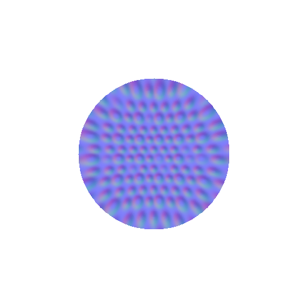

# dlxImg


## Overview

I've updated this as an imaging utility tool as I've worked on projects, this will eventually be updated imagine but for now we have two main tools

1. Stereographic Normalization Technique which remaps an image to a sphere UV coordinates
2. A Unity Mask tool which combines multiple PBR images into a single PNG Metallic (R), Ambient Occlusion (G), Detail Map (B), Smoothness Value (A) for a single RGBA image
Thanks for visiting, this is a golang utility for working with recti-linear textures and images that we would like to project stereographically with a conformal mapping.

The tool works with a process in unwrapping in blender where we would take the following steps:

1. Add a UV Sphere
2. Enter Edit Mode
3. Alt + Left Click to Select Edge Loop Around the Equator
4. Edges -> Mark Seam
5. Enter UV Editor
6. Ctrl + A Select all Sphere Points
7. U Unwrap Vertices (Should give us a hemisphere)

By apply default mode conformal projection (linear) to a rectilinear texture we can map it to this sphere without any distortion. Note that on a disk:

$$ dA = dr^2 \theta $$


## installation

```
go install github.com/andewx/unity-image
```

Installs `./unity-image`, typically your  `/usr/local/bin` or wherever your `$GOBIN` path is assigned.

## Usage

This tool has some useful options for dealing with textures as assets and formatting them for use in projects. Our tool mapped rectilinear textures to hemisphere projections. But also includes the `unity-mask` pbr tool for combining multiple image channels effortlessly and a `tex2darray` feature which will combine all images in a directory and produce a texture grid which can be passed to different projects.

Unstable Release


# Hemisphere Projection Options

1. Linear Magnitude projection - where the equatorial distorition is linear [default]
2. Quadratic - $x^2$ projection [-q]. This will stretch the texture by a factor along its mapped radial
3. Cubic - $x^3$ projection [-c]
4. Log - natural log projection [-ln]
5. Exp - Exponential projection. [-x]

## Options

- h - Shows help
- s (float) - Set scale
- l - Log uv mapping transforms
- c - cubic mode
- q - quadratic mode
- ln - log mode
- x - exponential mode
- tex2darray - Flipbook texture 
- umask - Creates a mask from multiple grayscale images as channels for an RGBA png image


## Support

This project likely will just be issued as is but if there are any suggestions or issues I will gladly handle them.

```
img2sphere inputfile.png example.png -ln
```




